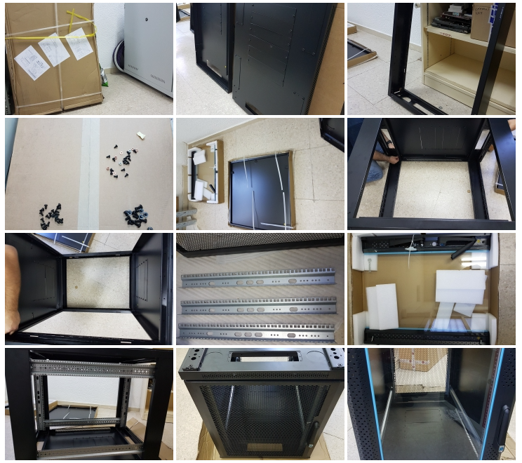
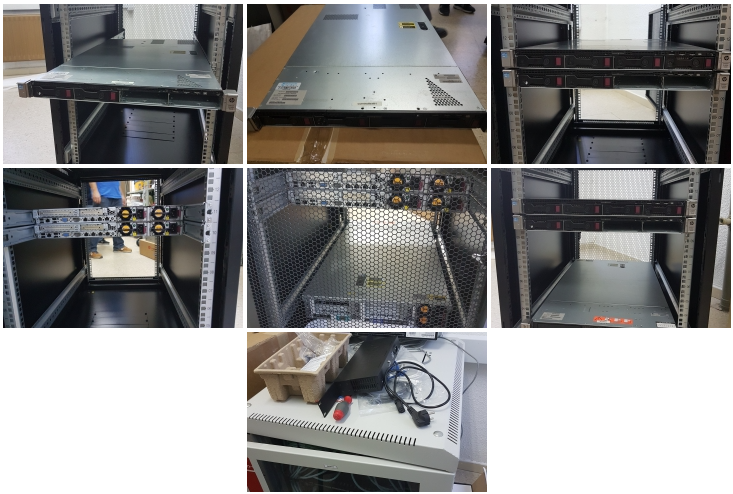
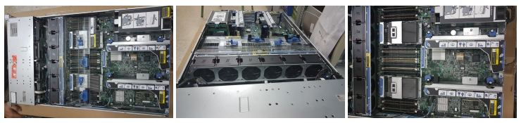
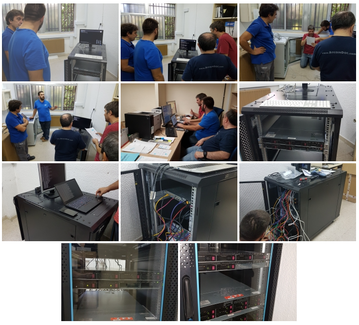

# Despligue del cloud

La empresa FLOSSystems realizó el despliegue del cloud en octubre de 2018, con ayuda de los profesores del Departamento de Informática del IES Leonardo da Vinci.

El proceso de despliegue comenzó con el montaje del rack y los servidores en una sala contigua a una de las aulas de Informática en el instituto:

Hubo ocasión de asomarse al interior de los nuevos servidores de HP, cuyo tamaño y prestaciones suponían toda una novedad para el instituto:

Una vez realizado el montaje comenzó el proceso de configuración. La primera parte se realizó in situ en la misma sala. A continuación hubo que realizar algunas acciones de configuración en la red del instituto:

A partir de ese momento, FLOSSystems pudo ya continuar con el proceso de despliegue del cloud de forma remota desde sus oficinas.