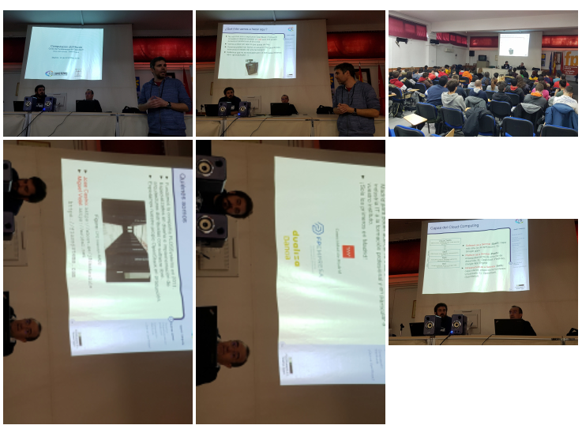
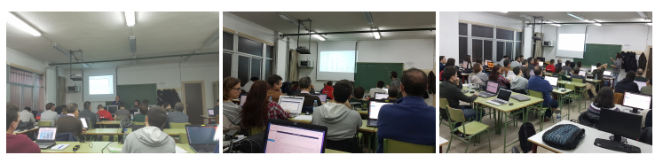
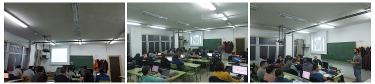
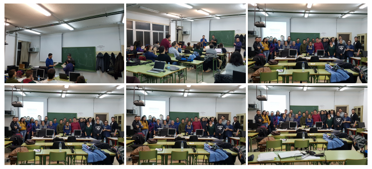

# Acciones de formación

Una parte fundamental de este proyecto de colaboración entre empresa e instituto era la formación: los ponentes de la empresa FLOSSystems realizaron tres acciones de formación diferentes en el IES Leonardo da Vinci:

## Formación inicial

El 10 de diciembre tuvo lugar en el Salón de Actos del instituto la formación inicial, de dos horas de duración, dirigida a todos los profesores y alumnos de informática de todos los ciclos que se imparten en el instituto (Sistemas Microinformáticos y Redes de grado medio, Desarrollo de Aplicaciones Web de grado superior, y Administración de Sistemas Informáticos en Red, también de grado superior). En esta formación se destacaba la importancia de la computación en la nube en el mundo empresarial. La formación se impartió dos veces el mismo día, una en turno de mañana y otra en turno de tarde, para poder alcanzar al mayor número posible de alumnos y profesores.

## Formación relativa a operaciones sobre el cloud privado

Entre los días 12 y 14 de diciembre se realizó la acción de formación titulada “Computación en la nube: Operaciones sobre OpenStack”. Esta acción de formación, de diez horas de duración, era más específica y requería un ordenador y conexión a Internet, por lo que se decidió realizarla en el aula dedicada al ciclo de grado superior Administración de Sistemas Informáticos en Red. Acudieron muchos profesores de informática y también alumnos de los demás ciclos.

## Formación relativa a la administración del cloud privado

Por último, entre los días 17 y 19 tuvo lugar la acción de formación titulada “Computación en la nube: Administración de OpenStack”. También de diez horas de duración, se trataba de la acción de formación de temática más avanzada y se realizó en el mismo aula.

## Despedida

Al terminar esta última acción de formación, dos de los jefes de estudios del instituto hicieron entrega a los ponentes de unos regalos y se realizaron fotos de grupo con ponentes y alumnos.

